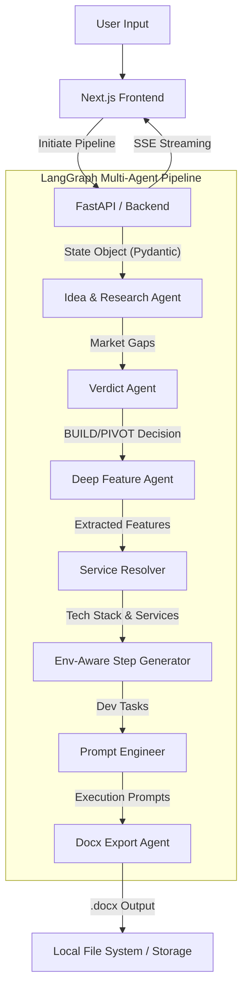

# FORGE: Engineering Depth & System Architecture

FORGE is more than a simple LLM wrapper; it is a highly resilient, fault-tolerant multi-agent orchestrator. This document explores the architectural decisions, structural boundaries, and fail-safes built into the FORGE pipeline to ensure deterministic, production-grade output.

---

## 1. Multi-Agent Topology & Flow

FORGE relies on a **stream-first, multi-agent topology** connected via Next.js and Server-Sent Events (SSE). 

The backend is driven by **LangGraph**, which maintains a strict, stateful graph of agents. Each agent acts as a node in the graph, receiving the global `State` object, mutating specific fields, and passing it to the next logical node.

---

## 2. Pydantic State Management & Context Preservation

Data propagation across agents is strictly regulated by **Pydantic Model Constraints**. This prevents "context collapse"—a common failure mode in LLM chaining where agents lose structure or hallucinate keys over long conversations.

### 2.1 The Recursive Type Coercion Engine
Because LLMs (even state-of-the-art models like Gemini 2.0 Flash) occasionally hallucinate JSON schemas (e.g., returning strings instead of integers in nested arrays), FORGE employs a custom **recursive `_coerce_types` validation engine**.
- It safely deserializes nested arrays and object matrices.
- It gracefully coerces faulty data (e.g., `"1"` back to `1`) inside lists.
- It guarantees that the downstream agent receives a 100% valid Python object, eliminating `Failed to call function` serialization crashes.

---

## 3. The 3-Tier LLM Fallback Router

To combat API rate limits, server outages, and burst exhaustion, FORGE does not rely on a single LLM provider. The LLM interaction layer is a masterclass in resiliency, utilizing a 3-tier fallback methodology wrapped in intelligent exponential backoff.

1. **Primary (Google Gemini 2.0 Flash):** Optimized for strict JSON extraction and deep Pydantic serialization. It acts as the backbone for heavy schema-adherence tasks.
2. **Secondary (Groq 70B):** Deployed for hyper-fast analytical reasoning and serves as an immediate fallback when Gemini rate limits are hit.
3. **Tertiary (Ollama Local):** Local model fallback ensuring zero-downtime persistence if cloud providers go down.

**Mitigation of Cascade Failures:** The system implements `resource_exhausted` interception and `INTER_AGENT_DELAY`. If the system detects rapid burst exhaustion from Groq followed by a Gemini failure, it halts, delays, and falls back seamlessly, avoiding catastrophic failure in the middle of a 10-minute pipeline run.

---

## 4. Asynchronous Next.js SSE Streaming

Long-running LangGraph processes can take several minutes. FORGE resolves the UX problem of "hanging loading screens" via **Server-Sent Events (SSE)**.

- **FastAPI Endpoint:** The backend exposes a `/api/forge/stream/{session_id}` endpoint.
- **Event Queue:** As each LangGraph node finishes computing, it pushes a delta update to an `asyncio.Queue`.
- **Client Rendering:** The Next.js client consumes this queue and uses libraries like `framer-motion` and `react-markdown` to incrementally stream the "thoughts" and "verdicts" of the agents directly to the UI.

This ensures a highly responsive, transparent user interface during complex multi-stage LLM chaining.

---

## 5. Intelligent Service Resolution & Caching

FORGE's Layer 1 prompts bypass superficial LLM hallucination by forcing external validation.

- **Tavily API Integration:** The research agent traverses Reddit, HackerNews, and Google to validate target demographics and establish hard numerical pricing ceilings.
- **Service Caching:** Web search APIs are expensive. FORGE implements a local SQLite cache for Tavily search results. If the pipeline searches for "Auth providers for React", the result is cached. Subsequent agents or future runs will hit the local SQLite cache rather than burning redundant API tokens, slashing costs by up to 70%.

---

## 6. Zero-Ambiguity Output Generation

The terminal phase of the graph invokes the **Docx Export Agent**. 
Rather than dumping markdown onto the screen and asking the user to copy-paste it, FORGE dynamically packages all extracted context, tech stacks, API schemas, and step-by-step developer prompts into a production-grade `.docx` guide. 

Path sanitization handles missing variables to avoid corrupted files, ensuring the user always leaves the system with a tangible, shareable artifact for their development team.
